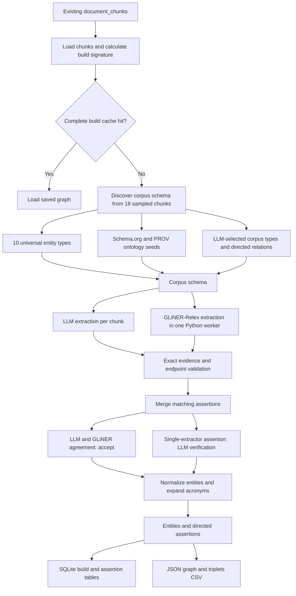

# Knowledge Graph New: Architecture and First-Run Findings

This document describes the current backend prototype and evaluates it using the
completed Tactical Combat Casualty Care handbook run from July 24, 2026.

The prototype is intentionally isolated. It reads the application's existing
`document_chunks`, builds graph data, and saves inspectable assertions. It is not
connected to the UI, ingestion flow, hybrid search, or RAG retrieval.

## Architecture

### 1. Existing chunks are reused

`knowledge-graph.ts` loads text from the existing `document_chunks` table. There
is no second document parser, chunker, or ingestion pipeline.

The build signature includes:

- extraction and build versions;
- provider and model settings;
- GLiNER settings;
- selected document IDs;
- chunk IDs and content hashes.

An unchanged signature can reuse the complete saved graph.

### 2. A corpus schema is discovered

The system samples up to 18 chunks and combines:

- 10 universal entity types;
- lexically relevant Schema.org and PROV terms;
- LLM-generated corpus-specific types and relations.

The intended limits are 15 entity types and 20 directed relation types. Generic
`related_to` and co-occurrence relationships are explicitly prohibited.

### 3. LLM and GLiNER extraction run in parallel

The LLM extracts exact subjects, objects, predicates, evidence, dates, negation,
and uncertainty one chunk at a time.

At the same time, one Python process loads
`knowledgator/gliner-relex-large-v0.5` and processes the chunks in checkpointed
batches. GLiNER receives the discovered entity and relation labels rather than a
large permanently hard-coded domain list.

### 4. Assertions are reconciled

Before reconciliation, an assertion must contain:

- a nonempty subject, predicate, and object;
- an exact evidence substring from the chunk;
- both raw endpoints inside that evidence;
- different subject and object values.

Matching LLM and GLiNER assertions are accepted as agreement. Assertions found
by only one extractor are sent to an LLM verifier, which checks support,
direction, context, and types.

### 5. Results are normalized and saved

The final stage performs lightweight name normalization and acronym expansion,
creates entity records, and saves:

- completed build metadata;
- per-chunk assertions with provenance;
- resumable schema, LLM, GLiNER, and final-result caches;
- an in-memory graph representation that can be exported as JSON or CSV.

Every successful chunk is checkpointed. A failed run returns partial results and
can resume without repeating completed LLM or GLiNER work.

## Completed Run

Data sources:

- `knowledge-graph-full.json`;
- `knowledge-graph-full-triplets.csv`;
- source text in `app.db`;
- a deterministic manual review of 48 assertions.

| Measure | Result |
|---|---:|
| Chunks completed | 269 / 269 |
| Build failures | 0 |
| Chunks producing at least one assertion | 175 / 269 (65.1%) |
| Entities | 765 |
| Assertions | 594 |
| Evidence strings found verbatim in source chunks | 594 / 594 |
| LLM-only assertions | 439 (73.9%) |
| GLiNER-only assertions | 119 (20.0%) |
| LLM and GLiNER agreement | 36 (6.1%) |
| Asserted relationships | 582 |
| Negated relationships | 12 |
| Uncertain relationships | 0 |

The captured run log reached LLM chunk 269 after approximately 22 minutes and
52 seconds. Caching allowed later retries and inspection without repeating those
completed calls.

## What Worked

### Reliable execution and recovery

All 269 chunks completed with no final failures. Schema, LLM, GLiNER, and
reconciled results were cached separately. This solved the earlier problem where
a late failure could discard an expensive run.

### Strong mechanical grounding

All 594 final assertions retain an evidence string found verbatim in the source
chunk, and every raw subject and object is present in that evidence. The graph is
therefore auditable down to its source text.

This protects against unsupported text generation, but it does not prove that
the selected entities, relationship meaning, or direction are correct.

### Inspectable provenance

Each assertion records its chunk, document, extractor or extractors, verification
state, raw endpoints, GLiNER score and offsets when available, and temporal or
negation status.

### The hybrid design contributed unique results

GLiNER contributed 119 assertions not retained from the LLM path, while the LLM
contributed 439 assertions not found by GLiNER. The extractors were therefore not
merely duplicating one another.

## Data-Driven Shortfalls

### 1. Schema discovery did not produce corpus-specific entity types

The final schema contained only the 10 universal types. It did not add medical
types such as drug, procedure, injury or condition, medical device, anatomical
site, care phase, or medical team.

The resulting entity distribution was:

| Entity type | Count |
|---|---:|
| object | 210 |
| process | 166 |
| other | 117 |
| organization | 76 |
| person | 61 |
| document | 52 |
| location | 37 |
| system | 25 |
| component | 13 |
| event | 6 |
| date | 2 |

`object`, `process`, and `other` account for 493 of 765 entities (64.4%). This is
too generic for a technical medical graph.

### 2. The relation vocabulary was effectively open-ended

The schema defined 14 relations, but the final graph contained 289 distinct
predicates:

- only 203 of 594 assertions (34.2%) used a schema relation;
- 391 assertions (65.8%) used out-of-schema predicates;
- 229 of 289 predicates (79.2%) occurred only once.

The current `fitsSchema()` implementation accepts a predicate when it is absent
from the schema. This preserves open discovery, but it prevents the result from
forming a stable graph ontology.

### 3. Hybrid agreement was low

Only 36 of 594 assertions (6.1%) were independently found by both the LLM and
GLiNER. Agreement therefore provided strong corroboration for only a small part
of the graph.

A cache audit found 1,096 raw GLiNER candidates and 520 raw LLM candidates. Only
155 final assertions had GLiNER provenance, while 475 had LLM provenance. GLiNER
was heavily filtered, while approximately 91% of LLM candidates survived.

Because the same LLM generated and verified the LLM-only candidates, this is not
independent verification.

### 4. GLiNER often extracted document structure instead of domain knowledge

`documented_in` was the most common predicate, appearing 69 times (11.6% of all
assertions). Many of these assertions connected procedures, equipment, or table
items to:

- page-numbered handbook titles;
- table names;
- inventory headings;
- document-layout fragments.

These links are grounded in the text, but they are better represented as
provenance metadata than as semantic graph edges.

### 5. Entity resolution was minimal

Only one of 765 entities had a recorded alias. Page-numbered variants of the
handbook, abbreviations, expanded names, table titles, and generic role names
frequently remained separate nodes.

The graph contained 214 connected components:

- the largest component contained 149 entities (19.5%);
- the second-largest contained 25;
- 596 entities (77.9%) had only one distinct neighbor.

This is a sparse collection of local triples rather than a well-resolved corpus
graph.

### 6. Some grounded assertions were still semantically wrong

Observed examples included:

- a relationship whose direction stated that people were `used_by` MARCH even
  though the passage said people use the MARCH algorithm;
- `casualty -> insert -> NPA`, incorrectly making the casualty the actor;
- imperative verbs such as `Insert` becoming entities;
- `CoTCCC-approved` being treated as an approving organization;
- sentence fragments becoming predicates or entity names.

The verifier can accept these because the relevant words occur in the evidence
even when the semantic role or direction is wrong.

### 7. Modality was flattened

The graph contained 582 asserted, 12 negated, and zero uncertain relationships.
Instructional recommendations were often stored as ordinary facts or encoded in
one-off predicates such as `should_include`.

Technical and historical corpora require explicit handling of recommendations,
requirements, hypotheses, disputed claims, and time-bounded facts.

### 8. Duplicate and low-value relationships remained

Fifteen assertions belonged to seven duplicated normalized triple groups.
Several high-degree nodes were generic or structural:

| Node | Distinct neighbors |
|---|---:|
| casualty | 55 |
| Role 3 facility | 16 |
| Table 3-3 | 11 |
| TACTICAL COMBAT CASUALTY CARE HANDBOOK | 10 |
| 55 TACTICAL COMBAT CASUALTY CARE HANDBOOK | 10 |

The page-numbered handbook variants demonstrate both entity-resolution and
document-structure leakage.

### 9. Manual usefulness was below an acceptable threshold

A deterministic sample of 48 assertions included LLM-only, GLiNER-only, and
agreement cases. Approximately 20 of 48 (41.7%) were judged both semantically
defensible and useful as durable graph facts.

This is a directional review rather than a formal precision estimate, but it is
not strong enough for graph-based retrieval or question answering.

## Overall Assessment

The prototype succeeded as extraction infrastructure:

- it reused existing chunks;
- ran both extractors concurrently;
- checkpointed expensive work;
- preserved evidence and provenance;
- produced inspectable JSON, CSV, and SQLite results.

It did not yet succeed as a high-quality knowledge graph. The main problem is no
longer execution reliability. It is semantic control: corpus typing, canonical
relations, entity resolution, relationship direction, modality, and removal of
document-layout artifacts.

Using this graph in retrieval now would risk producing an over-engineered form
of semantic search rather than reliable multi-hop graph reasoning.

## Recommended Validation Gates

Before integrating the graph with search or the UI:

1. Create a manually labeled benchmark of 30–50 representative chunks.
2. Require at least 85% useful-triple precision on that benchmark.
3. Require at least 90% relationship-direction and endpoint-type accuracy.
4. Map at least 90% of accepted assertions to a canonical relation vocabulary.
5. Move page, table, and `documented_in` data into provenance metadata.
6. Evaluate LLM-only, GLiNER-only, and combined extraction separately.
7. Add entity-resolution measurements for aliases, acronyms, and repeated names.
8. Reject or quarantine imperative verbs, fragments, generic headings, and
   unmapped predicates.

The next iteration should be judged against these measurements before another
full-corpus run is treated as a successful KG build.
